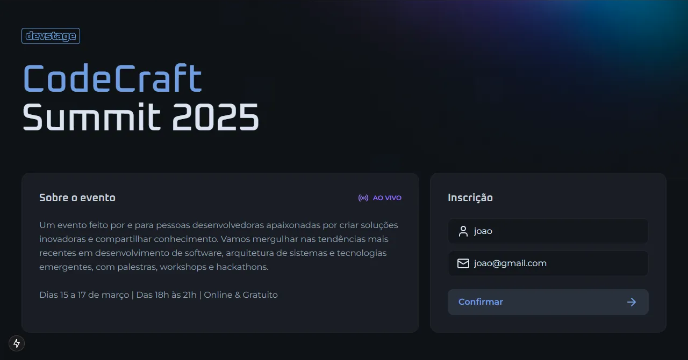
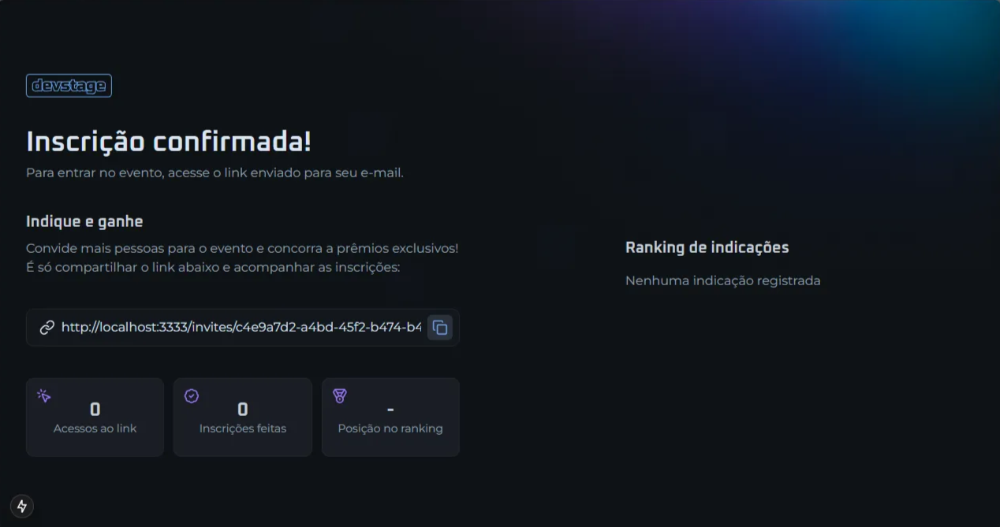
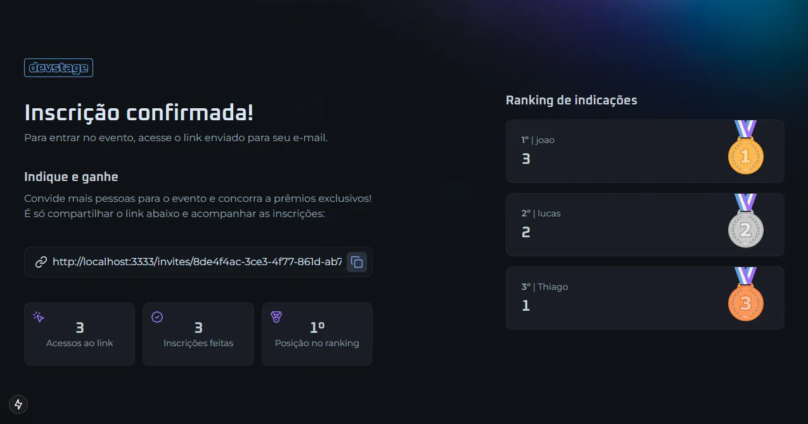

## 🏆 DevStage - Ranking de Convites para Promoções (Web)  

### 🚀 Visão Geral

A plataforma **DevStage** é um sistema de ranqueamento baseado em convites, onde os usuários podem se cadastrar e compartilhar um link exclusivo. Quanto mais pessoas entrarem por meio desse link, maior será a posição do usuário no ranking. Os 3 primeiros lugares ganham prêmios, incentivando a participação ativa e o engajamento.

Este repositório contém o Frontend web da plataforma, desenvolvido para fornecer uma interface moderna e intuitiva para os usuários.

## ✨ Características do Projeto

✅ Ranqueamento Dinâmico – Visualização em tempo real da posição dos usuários no ranking.
<br>
✅ Link de Convite Exclusivo – Cada usuário recebe um link único para compartilhar e convidar outros.
<br>
✅ Prêmios para os Top 3 – Os três primeiros colocados no ranking são premiados.
<br>
✅ Autenticação Segura – Integração com o backend para autenticação de usuários.
<br>
✅ Interface Moderna e Responsiva – Desenvolvida com Next.js e Tailwind CSS, garantindo uma experiência fluida em qualquer dispositivo.
<br>
✅ Validação de Formulários – Utilização de React Hook Form e Zod para validação de dados.

## 🛠️ Tecnologias Utilizadas

- **Next.js** – Framework React para renderização do lado do servidor (SSR) e geração estática (SSG).

- **Tailwind CSS** – Framework CSS utilitário para estilização rápida e responsiva.

- **React Hook Form** – Biblioteca para gerenciamento de formulários com validação eficiente.

- **Zod** – Biblioteca de validação de esquemas para TypeScript.

- **Lucide React** – Ícones modernos e elegantes para a interface.

- **Orval** – Gerador de clientes HTTP para integração com APIs.

## 🛠️ Ferramentas de Desenvolvimento

- **TypeScript** – Adiciona tipagem estática ao JavaScript para maior segurança e produtividade.

- **ESLint** – Linting para garantir a qualidade do código.

- **Biome** – Ferramenta de formatação e linting para JavaScript/TypeScript.

- **Turbopack** – Ferramenta de build rápida para desenvolvimento moderno.

## Como Rodar o Projeto Localmente

### Pré-requisitos

- Node.js (versão 20 ou superior)
- npm ou yarn (gerenciadores de pacotes)

### Passos

1. Clone o repositório:
   ```bash
   git clone https://github.com/JPerrut/devstage-frontend.git
   ```
2. Acesse a pasta do projeto:
   ```bash
   cd devstage-frontend
   ```
3. Instale as dependências:
   ```bash
   npm install
   ```
4. Inicie o servidor de desenvolvimento:
   ```bash
   npm run dev
   ```
5. Acesse o projeto no navegador:
   ```bash
   http://localhost:3000
   ```

## 🖼️ Telas da Aplicação

<table>
  <tr>
    <td align="center">
      
      <br><em>Tela inicial</em>
    </td>
    <td align="center">
      
      <br><em>Cadastro</em>
    </td>
  </tr>
  <tr>
    <td align="center">
      
      <br><em>Tela de indicação</em>
    </td>
    <td align="center">
      
      <br><em>Tela de ranqueamento</em>
    </td>
  </tr>
</table>

## 🤝 Contribuição

### Contribuições são bem-vindas! Siga os passos abaixo:

1. Faça um fork do projeto.
2. Crie uma branch para sua feature (`git checkout -b feature/nova-feature`).
3. Commit suas mudanças (`git commit -m 'Adiciona nova feature'`).
4. Faça push para a branch (`git push origin feature/nova-feature`).
5. Abra um Pull Request.

## 📄 Licença

Este projeto está licenciado sob a <a href="https://opensource.org/license/mit">MIT License</a>.

## 📞 Contato

### Se tiver dúvidas ou sugestões, entre em contato:

Nome: João Perrut <br>
Email: joaoperrutc@gmail.com <br>
Linkedin: https://www.linkedin.com/in/perrut/
